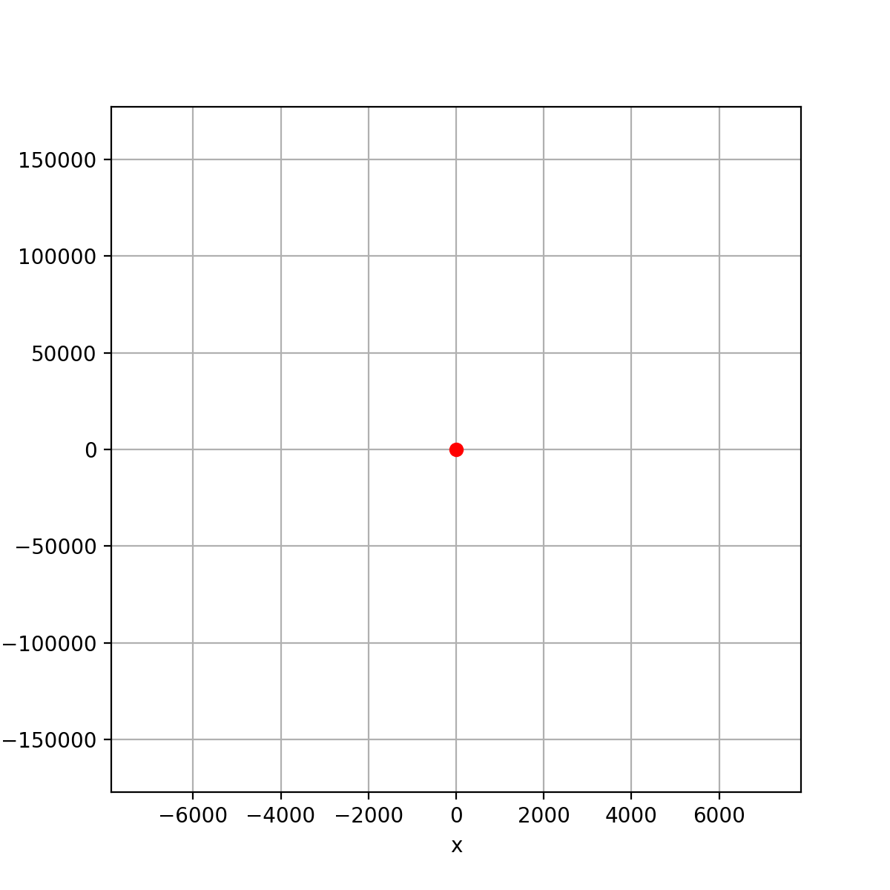
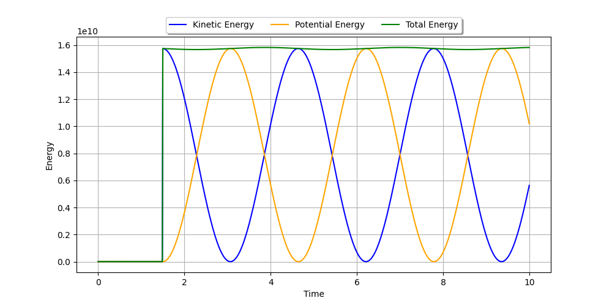
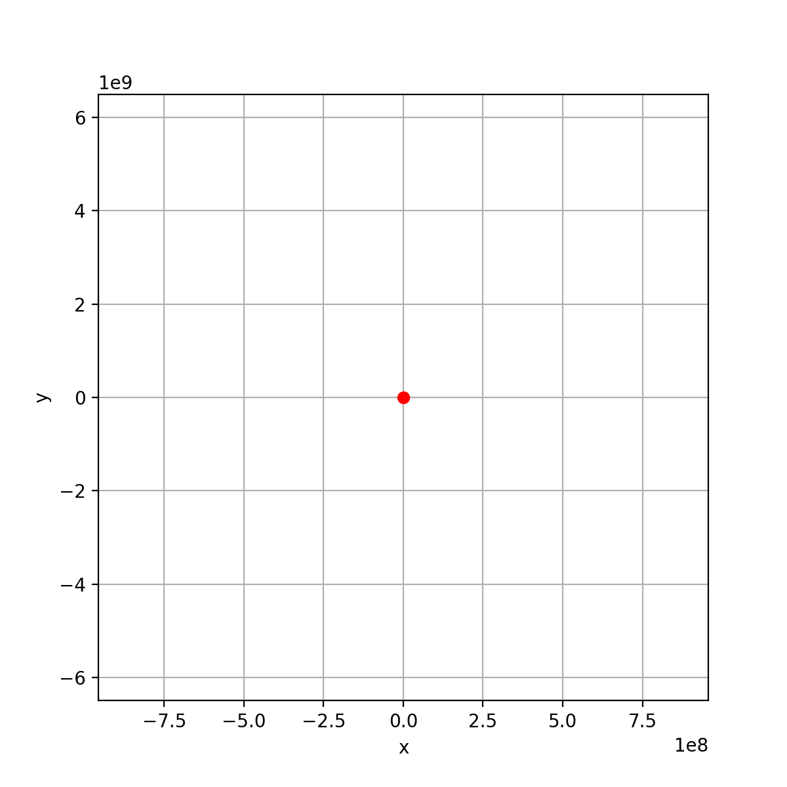
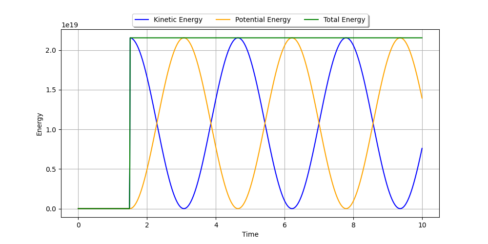

# Molecular dynamics

This project is for the Cimulation and Modeling course of the Summer
2025 semester in Uni Koln.

## TO-DO

 - [x] Setup
 - [x] Single particle
  - [x] Newton's equations
  - [x] Potential definitions
  - [x] Euler step
  - [x] Verlet step
  - [ ] Check energy conservation
 - [ ] Multi particle
  - [ ] Random configuration with sufficient particles
 - [ ] Implement damping
 - [ ] Try different time steps
 - [ ] Analyze floating point efficiency
 - [ ] Describe formal scaling wrt N
 - [ ] Improvement based on sparse systems?

## Design decisions:

 - Poetry for project management
 - Animations of dynamics
 - Slide flow (bottom-up):
   - Single particle dynamics
   - Symplectic schemes
   - Scaling to multiple particles

## Setup

To replicate results

 1. Install [poetry](https://python-poetry.org/docs/)
 2. Clone the repo
 3. `$ poetry install`
 4. `$ python simulation.py`

## Outputs

### Single-particle with euler step

#### Only harmonic force field

  
  

#### Only lennard-jones force field

  
  

#### Only morse force field

  
  

#### Combined

  
  

  
  

#### Combined (unstable)

By changing A, B in lennard-jones from 1, 1 to 10, 10

  
  

  
  

### Multi-particle

### With euler step

### With verlet step